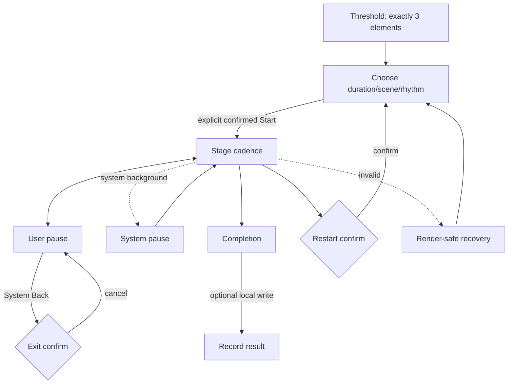

# Interaction / Spatial Design Spec · TideBeacon

> Active artifact revision: **10** | Stage 12 P-03 final decision-output reconciliation; pending gate confirmation.

## 0. Role Trace and Stage Boundary

- Inputs: PM rev5, UXR rev7, Stage 4 final pass.
- Stage 5 decides tasks, inputs, decisions, consequences, frequency and dependencies. It does **not** decide concepts, visual direction, containers, states, layout, components, motion, or delivery status.
- Competitive benchmark is consumed only for functional coverage/omission; no competitor path or UI is copied.

## 1. Direct Description of Current Output

The task and decision graph below represents what the wearer or system must decide, not screens. IDs are semantic task IDs and may be referenced downstream.

## 2. Design Principles

| ID | Assertion-style principle | Scope | Derivation basis | Downstream checkpoint | Precedence |
|---|---|---|---|---|---|
| P1 | One shared monotonic active-time value is the only authority for phase, halo pose, audio envelope, countdown, cycle accent and completion. | product/interaction/data | PM O3/O4; UXR E-D1/F4 | timing model, motion/audio bindings, tests | highest with P2 |
| P2 | Safety and stable control override immersion: no forced camera, flash >3/s, hidden elapsed time, unconfirmed restart/exit, or trapped Stage. | interaction/spatial/safety | PM O4/O5/O8/O9; E-P1/E-P2c/E-S1 | transition graph, motion, error recovery | highest with P1 |
| P3 | The active cadence has exactly one spatial focus; controls and data recede until explicitly needed. | spatial/visual | PM O1/O2; UXR mental model; central-attention risk | primaryFocusCount, visibility rules | above richness/customization |
| P4 | Non-medical privacy is visible in behavior: no sensing, assessment, score, streak, account, or inferred outcome. | product/data trust/copy | R2/R3/R11, O6/O7 | permissions, strings, local record | cannot be traded for engagement |
| P5 | Every menu and safety path is controller-complete, text-scalable, non-color-only, and has Reduce Motion behavior. | accessibility/interaction | E-P2a, PM O5 | input map, component states, preview | overrides decorative fidelity |

- **Conflict arbitration**: P1/P2 > P5 > P3 > visual richness. If spatial spectacle conflicts with cadence legibility, timing, safety, or controller access, spectacle is removed.
- **Negative list**: no dashboard, multi-window control wall, biofeedback, automatic camera movement, full-field pulse, drifting auxiliary clocks, score, efficacy copy, or hidden exit.
- **Selected-concept consistency**: the Threshold-to-Beacon concept below supports all five principles; any later architecture change must re-review them.

## 3. Task / Decision Model

| Task ID / task | Actor | Scenario | Input information / evidence | Decision output | Consequence of error | Frequency | Dependencies | Decision duration |
|---|---|---|---|---|---|---|---|---|
| T1 Interpret the cadence | wearer | first entry | exact copy and halo expansion/contraction requirement, PM R4/O1; UXR F1 | `mappingUnderstood` or continue observing | wrong inhale/exhale mapping; no safe progress cue | once per first entry; revisitable | none | ≤5s hypothesis, UXR §10 |
| T2 Choose session bounds | wearer | before start or after confirmed restart | duration {2,4,6}, scene {sea,cloud,dune}, available local pattern labels; R5/R6/O2 | `selectionConfirmed(duration,scene,pattern)` | undesired duration/environment/rhythm; user may abandon | once per session, repeat on restart | T1 | ≤20s for all choices, UXR §10 |
| T3 Validate start | system + wearer | explicit start request | complete selection; valid positive four phase durations; explicit Stage-entry obligation; R1/R6, E-P1 | `startAccepted` or `startRejected(reason)` | invalid time values cause NaN/drift/crash; implicit Stage entry violates gate | once per attempt | T1,T2 | immediate system validation; user confirmation ≤2s hypothesis |
| T4 Follow active phase | wearer + deterministic clock | active session | `activeElapsedNanos`; BreathPattern phase boundaries; audio/visual/countdown bindings; R6/R7 | semantic result `phaseGuidanceAccepted(currentPhase,progress)` or wearer pauses/exits; system output remains one derived phase/progress/cycle | cross-channel drift makes cue untrustworthy | every frame/sample; wearer decision each phase | T3 | phase-dependent configured duration |
| T5 Control interruption | wearer or lifecycle system | active or user-paused/system-interrupted session | current active elapsed; lifecycle cause; R9/R12/R16/R18 | `userPaused`, `systemInterrupted`, `resumeSamePhase`, or stay paused | hidden elapsed jump, pop, phase skip, accidental restart/exit | zero or more times/session | T4 | feedback ≤100ms target; decision user-paced |
| T6 Decide restart or exit | wearer | active or paused; System Back while paused | current progress, requested action, stable-exit and confirmation obligations | confirm/cancel restart; confirm/cancel exit; paused Back maps only to exit confirmation | irreversible progress loss or unintended restart/exit | exceptional | T4 or T5 | user-paced; confirmation mandatory |
| T7 Complete the interval | deterministic clock + wearer | active elapsed reaches selected duration | single time source, complete-cycle event, selected duration; R7/R8/R11/O7 | `sessionCompleted`; show binary completion, no assessment | early/late completion; stray particles; efficacy/score implication | once per natural completion | T4 | exact duration boundary, ±1 rendered frame |
| T8 Decide local persistence | wearer + local store | after natural completion only | optional-record activation; local-write availability; R11/R18 | if activated: `recordSaved` or `recordFailed`; if not activated: wearer leaves via System Back/TR24 with no write and no record-result claim | false success claim, completion blocked, privacy surprise | at most once/completion | T7 | user-paced; write result immediate/local |
| T9 Recover invalid/render-unsafe input | system + wearer | validation/time/render/storage/overflow failure | invalid pattern from T3; clock regression/missing binding from T4/T5; persistence denial/full from T8; overflow from T1/T2/T6/T7 | `startRejected` for T3; `cadenceFrozenAndMuted` for T4/T5; `completionKeptRecordFailed` for T8; `contentReflowOrStableReturn` for overflow; never clock advance/fabricated success | crash, NaN style, trap, fabricated saved state | exceptional | T1,T2,T3,T4,T5,T6,T7,T8 by listed fault class | immediate safety response; user recovery user-paced |

### 3.1 Task dependencies

- Serial happy path: `T1 → T2 → T3 → T4 → T7 → T8`.
- Interrupt branch: `T4 ↔ T5`; resume returns to the same active-time phase.
- High-impact branch: `T4/T5 → T6`; cancel returns unchanged, confirm restart returns to the choice obligation, confirm exit closes through stable exit.
- Recovery: `T1/T2/T6/T7 → T9` for overflow; `T3 → T9` invalid configuration; `T4/T5 → T9` clock/binding; `T8 → T9` storage. Recovery never silently converts failure into success.
- Mutually exclusive terminal decisions: natural completion, confirmed exit, or confirmed restart of the current run.

### 3.2 Key wearer decisions

1. Do I understand larger=inhale and smaller=exhale?
2. Which duration, scene and rhythm do I want?
3. Start now?
4. Pause/resume, restart, or exit?
5. After completion, activate the optional local save or leave with System Back?

### 3.3 Competitive functional coverage reconciliation

| Benchmark capability | TideBeacon disposition | Evidence / rationale |
|---|---|---|
| expansion/contraction phase cue | included in T1/T4 | SRC-USER R4/R6; Apple sample is precedent only |
| duration/rate/pattern choice | duration and pattern included in T2 | R5/R6; bounded choices minimize catalog load |
| early end | included via T6 confirmed exit | R9 + stable-exit registry gate |
| sound/haptic/voice customization | spatial audio follows shared clock; voice/haptic customization deliberately omitted | product is pure visual/spatial audio; no requirement/evidence for more modes |
| classes/catalogs/challenges/records | classes/challenges/catalogs omitted; one optional non-evaluative record only | R3/R11; prevents performance/efficacy framing |
| AI, accounts, sensing, biofeedback | deliberately omitted | R3/O6 privacy and non-medical boundary |
| immersive worlds | three procedural low-poly environments included as T2 choice; spatial value still must be proven in Stage 6 | R5/R13; no visual copying |

## 4. Spatial Value Justification

| Task | Spatial-value dimensions and rating | Spatial rationale | 2D counterfactual | Benchmark / conclusion |
|---|---|---|---|---|
| T1 interpret cadence | D✓ distant audio; Dist✓ beacon; Scale✓ halo; Depth✓ separation; Pos✓ stable center; Motion✓ radial only; Body✗; Collab✗; Sim✗; Time✓ phase; **medium-high** | one distant event combines scale/time/direction; body/collaboration/simulation add no task value | centered expanding 2D circle + sentence fully works | Stage not necessary for comprehension alone |
| T2 choose bounds | D✗ Dist✗ Scale✗ Depth✗ Pos✗ Motion✗ Body✗ Collab✗ Sim✗ Time✗; **low** | semantic choices gain no spatial value | bounded 2D choices are more efficient | do not spatialize menu decisions |
| T3 validate/start | D✗; Dist✓ threshold-to-environment; Scale✗; Depth✓; Pos✗; Motion✓ calm transition; Body✗; Collab✗; Sim✗; Time✓ explicit moment; **medium** | explicit reversible depth transition can make Full Space entry legible; other dimensions unnecessary | Start action + fade in one window works | value conditional on comfort/reversibility |
| T4 follow phase | D✓ audio/beacon; Dist✓ far anchor; Scale✓ halo; Depth✓ environment; Pos✓ stable anchor; Motion✓ radial; Body✗; Collab✗; Sim✓ environmental cadence; Time✓ phase/cycle; **high** | stable far anchor, radial scale and local audio support cue without reading; no body/collab need | full-screen 2D animation/audio/countdown works but lacks world anchor/depth | primary Stage necessity carrier |
| T5 interruption | D✗ Dist✗ Scale✗ Depth✓ whole scene; Pos✓ frozen; Motion✓ stop; Body✗ Collab✗ Sim✓ world still; Time✓ frozen; **medium** | whole scene stillness reinforces shared-clock freeze; direction/distance add nothing | 2D freeze feedback suffices | secondary Stage reinforcement only |
| T6 restart/exit | D✗ Dist✗ Scale✗ Depth✗ Pos✗ Motion✗ Body✗ Collab✗ Sim✗ Time✗; **low** | semantic confirmation only | blocking 2D confirmation is clearer | Stage adds no value |
| T7 complete | D✗ Dist✗ Scale✓ restrained accent; Depth✓ scene closure; Pos✓ beacon; Motion✓ subtle; Body✗ Collab✗ Sim✓ environment; Time✓ boundary; **medium** | boundary-timed environment acknowledgment supports closure; no body/collab need | exact 2D completion copy fully works | optional spatial reinforcement |
| T8 persistence | D✗ Dist✗ Scale✗ Depth✗ Pos✗ Motion✗ Body✗ Collab✗ Sim✗ Time✗; **low** | storage decision has no spatial value | 2D optional action is superior | no spatial embellishment |
| T9 recovery | D✗ Dist✗ Scale✗ Depth✗ Pos✗ Motion✗ Body✗ Collab✗ Sim✗ Time✗; **low** | safety/readability dominate every spatial dimension | bounded readable recovery is superior | use non-spatial clarity |

**Stage necessity verdict**: Stage is justified only for T4's stable directional/distant environmental cue plus T5's whole-scene freeze and T7's restrained spatial closure. T1/T2/T6/T8/T9 remain essentially 2D decisions. Therefore the concept must enter Stage explicitly, keep a stable exit, and avoid spatializing menus.

## 5. Design Hypotheses

| Hypothesis | Information organization | Spatialization | Container strategy (concept-level, not final architecture) | User path | Primary interaction | Risk / engineering cost |
|---|---|---|---|---|---|---|
| H-A **Threshold-to-Beacon** | exact three-element threshold → compact choices → single-focus cadence → binary completion | bounded threshold then explicit Full Space Stage; distant beacon and ambient sound only during cadence | one bounded threshold experience followed by one Stage; menus remain in-place and temporary | learn → choose → explicitly cross threshold → follow/pause → complete/exit | gaze/controller targeting; no manipulation | medium; two space states and shared timeline, low scene complexity |
| H-B **Window Tide** | all information in a single calm timeline-oriented Planar experience | no Stage; 2D halo and stereo/spatialized audio inside one window | one Planar WindowContainer only | learn/choose/follow/complete without space switch | controller navigation and one central cue | low; strongest efficiency/accessibility, weakest spatial differentiation |
| H-C **Orbiting Waypoints** | duration, scene and rhythm occupy three environmental directions; wearer confirms by looking/pointing around | Full Space throughout; choices and cues distributed at different azimuths/depths | Stage with spatially separated choices and a central beacon | orient body/head → visit spatial choices → return center → follow | controller ray + head turning | high; attention travel, occlusion, accessibility and motion/fatigue risk |
| H-D **Handheld Lantern** | a near virtual lantern embodies phase while distant environment responds | Volumetric near object plus optional Stage background | object-centric threshold then Stage environment | choose → hold/observe lantern → follow reflected environment | controller manipulation plus fallback focus | high; adds hand task, potential body fatigue and sensing-like misinterpretation |

## 6. Concept Selection

Scores are 1–5; total /40. `1` conflicts strongly/unsupported, `3` viable with material assumption or tradeoff, `5` strongly supported at design-constraint level. Comfort scores mean design-constraint comfort only, never device comfort. Distinctiveness means internal concept separation; market differentiation remains bounded to the three-product sample.

| Hypothesis | Task efficiency | Spatial value | PICO comfort | Domain depth | Safety | Accessibility | Engineering feasibility | Distinctiveness | Total | Verdict |
|---|---:|---:|---:|---:|---:|---:|---:|---:|---:|---|
| H-A Threshold-to-Beacon | 4 | 5 | 5 | 5 | 5 | 4 | 4 | 5 | **37** | selected |
| H-B Window Tide | 5 | 2 | 5 | 4 | 5 | 5 | 5 | 2 | 33 | rejected |
| H-C Orbiting Waypoints | 2 | 5 | 2 | 3 | 2 | 2 | 2 | 4 | 22 | rejected |
| H-D Handheld Lantern | 3 | 4 | 3 | 3 | 3 | 2 | 2 | 5 | 25 | rejected |

| Hypothesis | Evidence/assumption rationale for comfort, accessibility, engineering, distinctiveness |
|---|---|
| H-A | Comfort 5: no forced camera/head travel, one focus, explicit entry/exit; device comfort `not_performed`. Accessibility 4: controller/2D decisions strong, Full Space transition still needs testing. Engineering 4: procedural scenes + one clock feasible, lifecycle/audio sync nontrivial. Distinctiveness 5 internally: threshold + deterministic beacon differs sharply from B/C/D; market advantage remains hypothesis. |
| H-B | Comfort/accessibility/engineering 5: one bounded Planar counterfactual, no space switch; physical validation still absent. Distinctiveness 2: functionally sound but close to established 2D scale/time precedent. |
| H-C | Comfort/accessibility/engineering 2: head travel, distributed targets and spatial focus management create documented design risks; distinctiveness 4 but not sufficient to offset them. |
| H-D | Comfort 3/accessibility 2/engineering 2: manipulation/body demand and fallback complexity are assumptions; distinctiveness 5 internally, but risks sensing inference. |

- **Selected concept**: **Threshold-to-Beacon** — preserve the exact three-element first encounter in a bounded threshold, ask for explicit continuation and choices, then place one distant lighthouse/halo cue in a quiet Full Space Stage whose light, sound, countdown, freeze and completion all share one clock.
- **Evidence**: T4 high spatial rating; T1/T2/T6/T8/T9 2D counterfactuals; PM O1–O10; E-P1 Stage entry/exit; E-P2a accessibility; UXR §3A opportunity summary.
- **Market positioning**: a narrow, private, non-inferential spatial cadence instrument rather than a wellness catalog, class, AI coach, biofeedback game, or performance tracker.
- **Differentiation rationale**: absorbs the sampled Apple direct scale mapping and configurable duration/rate need, Breathwrk phase configurability, and TRIPP immersive/audio opportunity; avoids health/performance framing, challenges, AI/stat tracking, content sprawl, and unsourced superiority claims. It adds a deterministic shared clock and exact whole-scene pause rather than copying any competitor UI.
- **evidenceRefs**: UXR E-M1/E-M2/E-M3, E-D1/E-D2, E-P1/E-P2a/E-P2c, §3A CB1–CB3 and “Our differentiation opportunities within this three-product sample”. PICO-native competitive superiority remains prohibited by the recorded gap.
- **Rejected H-B**: fully viable fallback and best 2D counterfactual, but it underuses requested Stage and cannot deliver genuine direction/distance/depth; retain as fallback if Stage comfort fails later device validation.
- **Rejected H-C**: spatial choice distribution increases head travel and makes a menu spatial for its own sake, conflicting with P2/P3/P5.
- **Rejected H-D**: distinctive but invents manipulation/body burden, weakens controller simplicity, and risks implying breath-responsive sensing.
- **Stage 6 concept-selection judgment**: pass for selection evidence, because H-A demonstrates direction/distance, scale/time, environment/audio depth and one focus while keeping semantic decisions 2D. Stage 8 visual-direction/design-effect approval is **not_performed**.

## 7. Experience and Container Architecture

### 7.1 Experience layers

| Layer | Responsibility / host | Entry / exit | Fallback |
|---|---|---|---|
| Threshold | understand mapping and choose session; `WC-Threshold` Planar in Shared Space | app launch; explicit Start opens Stage; System Back closes app through confirmation when choices would be lost | remains in Shared Space; invalid input stays render-safe here |
| Cadence | follow one beacon cue; `ST-Beacon` Stage Full Space, immersion Full 100 | explicit confirmed Start after valid selection; confirmed exit closes Stage and returns to Threshold | lifecycle/user pause freezes; fatal cadence input closes Stage to Threshold with recovery copy |
| Completion | binary closure inside Stage until record choice/exit | natural duration boundary; exit closes Stage to Threshold/app | storage failure keeps completion and reports not saved |

Immersion value is T4 direction/distance/depth, T5 whole-scene freeze, T7 restrained closure; menus never require spatial travel.

### 7.2 Containers and legality

| ID | Type/form | Space state | Tasks | Default visibility | Entry/exit/fallback |
|---|---|---|---|---|---|
| WC-Threshold | WindowContainer Planar, depth fixed 640dp | Shared Space | T1,T2,T3,T9 | visible at launch, only primary window | explicit confirmed Start closes/recdes window and opens Stage; Stage close restores it |
| ST-Beacon | Stage Full 100 | Full Space (exclusive) | T4,T5,T6,T7,T8,T9 | hidden until explicit Start | `user.startConfirmed`; stable exit closes Stage → Shared Space WC-Threshold |

- Stage origin follows platform Stage behavior; no MR perception, microphone, hand-pose, plane, or anchor permission requested.
- Only one primary attention locus visible. No Volumetric container; the environmental lighthouse exceeds bounded-window spatial intent and belongs in Stage.

## 8. Window Attachment Decision Matrix

| Need | Placement | Selected | Host | Semantics / persistence / frequency | Rationale | Rejected alternatives incl. Inline/None | Validation |
|---|---|---|---|---|---|---|---|
| duration/scene/rhythm choices | in-window | InlineControl | WC-Threshold | current-step decisions; persistent only in selection; once/session | acts directly on current selection | None rejected: choices required; TabBar/Toolbar/Subwindow/Augment rejected semantic mismatch | controller traversal, 56dp targets |
| restart/exit confirmation | in-window modal | AlertDialog | WC-Threshold when Shared; Stage-owned planar overlay when Full | blocking high-impact decision; temporary/exceptional | response required before loss/exit | InlineControl rejected: insufficient blocking; None rejected: unsafe; Popup/Sheet rejected weaker/longer semantics | confirm/cancel/Back tests |
| active pause/resume/restart/exit commands | in-window Stage overlay | InlineControl | ST-Beacon | on-demand control scope; frequent pause, rare restart/exit | near current cadence and hides when not summoned | None rejected: required; Toolbar rejected because host is Stage/no window and commands must not be always visible; Augment rejected | controller-only and focus restoration |
| first-use hint | none | None | WC-Threshold | N/A | exact sentence already carries instruction; no fourth visible element | Coachmark rejected: violates first-visible set; InlineControl rejected as visible control | visible-set assertion |
| spatial decoration around window | none | None | WC-Threshold | N/A | no task value | Augment rejected; InlineControl rejected; None selected | absence inspection |

Content exclusivity: each operation exists in exactly one active location. No TabBar, Toolbar, Subwindow, Popup, Augment, Sheet or Coachmark.

## 9. Window Sizing Derivation

| Window | form/unit | Tier/baseline | Content/topology/density | Viewing/FOV | Floors/overhead | Candidates | Selected default | min/max | Aspect/resize |
|---|---|---|---|---|---|---|---|---|---|
| WC-Threshold | Planar dp; depth fixed 640dp | productivity/main; official start 1280×720dp; legal 320×180–2700×1800 | first view: 3 centered items; selection: three groups + Start; low density | stationary assumption; ~1.75m default; Dynamic worldScale. Methodology-relative occupancy calibration against 1280×720=65°×40°: Constrained 720×560≈36.6°×31.1°; Compact 960×640≈48.8°×35.6°; Regular 1120×700≈56.9°×38.9°; Large 1440×900≈73.1°×50°. Large remains below the methodology secondary 85°×55° bound, but all figures are design estimates pending device measurement. | ≥56×56dp targets, ≥12dp body; CJK line <50 chars; no docked attachment/TitleBar content overhead | 720×560 constrained; 1120×700 default; 1440×900 large | **1120×700dp** | **min 720×560; max 1440×900** | flexible 1.2–1.8; `ContentMinSize`; user resize; no global scale |

- **Large 1440×900**: selectors share one row; instruction width capped; extra negative space.
- **Regular/default 1120×700**: three choice groups in one row under 240dp preview; controls remain ≥56dp.
- **Compact 960×640**: preview collapses to 160dp thumbnail, choice row 184dp, Start72dp.
- **Constrained 720×560**: preview is hidden in S2 (selection labels retain scene meaning); content area656×496 contains C2 scroll 392dp + gap16 + sticky C3 72dp =480dp; text/targets do not scale.
- Shared Space occlusion: one window only, no adjacency; default low-saturation transparent/solid balance and centered core. Logical dp is not physical size.
- Downstream validation: inspect FOV/readability/controller hit on PICO at default/min/max and both stationary postures before runtime acceptance.

## 10. State and Transition Graph

| State | Task/decision | Focus | Container/layout/components (semantic) | Data | Entry / exit | Exception / return |
|---|---|---|---|---|---|---|
| S1 Threshold | T1 mapping understood | halo | WC centered three-element-only | exact copy | launch / `user.continue` | render failure → S10 |
| S2 Selection | T2 selectionConfirmed | three decisions then Start | WC bounded choice composition | selection/patterns | from S1 or restart / Start | invalid pattern → S10 |
| S3 Cadence | T4 phaseGuidanceAccepted | beacon halo | Stage single-focus; controls hidden | clock/pattern/selection/audio | confirmed Start / pause, complete, controls | lifecycle → S5; data → S10 |
| S4 UserPaused | T5 resume/stay/act | paused halo + on-demand controls | Stage frozen | frozen clock/audio gain 0 | user pause / resume or dialog | System Back → S6 ExitConfirm, never restart |
| S5 SystemPaused | T5 wait/resume same phase | system interruption mark | Stage frozen; distinct lifecycle state | lifecycle + frozen tick | system pause / foreground restore | invalid resume → S10 |
| S6 ExitConfirm | T6 confirm/cancel exit | exit decision | blocking Dialog in the current legal container | prior state ∈ S1/S3/S4/S5 | exit request/Back / confirm or cancel | cancel returns exact prior; systemPaused remains frozen |
| S7 RestartConfirm | T6 confirm/cancel restart | restart decision | blocking Dialog | prior state | restart request / confirm S2, cancel prior | never entered by System Back |
| S8 Completion | T7/T8 optionally save or leave | exact completion copy | Stage quiet completion; only copy + optional local record | completion/local store | duration reached / save or System Back exit | write fail → S9; no separate skip/finish control |
| S9 RecordResult | T8 acknowledge saved/failed | record result | Stage completion context | localStorage result | write attempt / exit | failure copy `未保存记录`; completion preserved |
| S10 RenderSafeRecovery | T9 stable recovery | readable recovery | current container if safe, otherwise WC | error class | invalid/NaN/overflow / return selection or close | no undefined rendering; clock/audio stopped |

| Transition ID | From → To | Trigger | Action | Confirm |
|---|---|---|---|---|
| TR1 | S1→S2 | `user.continue` | reveal choices | no |
| TR2 | S2→S3 | `user.start` | validate; prompt Stage entry; open Stage/start monotonic clock | **yes** |
| TR3 | S3→S4 | `user.pause` | freeze clock/visual/audio/countdown | no |
| TR4 | S4→S3 | `user.resume` | keep phase; ramp gain 600ms | no |
| TR5 | S3/S4→S5 | `system.backgrounded` | freeze at monotonic tick, gain 0 | no |
| TR6 | S5→S3/S4 | `system.foregrounded` | restore originating pause semantic; gain ramp only if active | no |
| TR7 | S3→S8 | `clock.durationReached` | freeze terminal pose; exact completion | no |
| TR8 | S3/S4→S6 | `user.exitRequested` | open blocking exit decision | yes |
| TR9 | S4→S6 | `system.back` | open exit decision | yes |
| TR10 | S6→prior | `user.cancelExit` | restore exact prior | no |
| TR11a | S6(prior S3/S4/S5)→S2 | `user.confirmExit.returnThreshold` | close Stage; restore valid selection without altering it | yes |
| TR11b | S6(any prior)→closed | `user.confirmExit.closeApp` | close active container then app | yes |
| TR12 | S3/S4→S7 | `user.restartRequested` | open restart decision | yes |
| TR13 | S7→S2 | `user.confirmRestart` | close Stage; reset active clock; retain editable selection | yes |
| TR14 | S7→prior | `user.cancelRestart` | restore exact prior | no |
| TR15 | S8→S9 | `user.saveLocal` | write actual local record | no |
| TR17 | any relevant→S10 | `data.invalidOrOverflow` | stop/mute; classify; render safe | no |
| TR18 | S10→S2 | `user.returnSelection` | discard invalid active run | no |
| TR19 | S1→S6 | `system.back` | open exit confirmation with prior=S1 | yes |
| TR20 | S2→S1 | `system.back` | hide choices; restore exact three-element threshold | no |
| TR21 | S3→S3 | `system.back` | reveal on-demand C4 controls; keep clock active | no |
| TR22 | S5→S6 | `system.back` | keep all channels frozen; open exit confirmation with prior=S5 and no restart action | yes |
| TR23 | S6/S7→prior | `system.back` | cancel dialog; restore exact prior | no |
| TR24 | S8/S9→closed | `system.back` | finish without forcing record write; close Stage | no |
| TR25 | S10→closed | `system.back` | invoke native stable exit | no |
| TR26 | S3/S4→S7 | `user.changePattern` | open confirmed restart decision; clock remains frozen only if prior=S4 | yes |
| TR27 | S10(clock)→S2 | `user.restartSafe` | stop/mute invalid run; reinitialize clock only after valid selection; retain editable valid choices | yes |
| TR29 | S10→closed | `user.exitSafe` | invoke stable native/app exit | no |
| TR31 | S10(overflow)→S2 | `user.resolveOverflow` | use native/plain safe action; stop invalid active run and return selection | no |
| TR32 | S10(nativeFallback)→S2 | `user.nativeReturnSelection` | invoke bundled native safe action independent of app renderer | no |
| TR33 | S10(nativeFallback)→closed | `user.nativeExit` | invoke bundled native exit independent of app renderer | no |

## 11. End-to-End Flow

- Happy path: S1→S2→S3→S8→finish, with 2-minute selection accepted.
- Stable exit: confirmed close Stage returns Shared Space/close; every Dialog cancels to exact prior state.
- Journey mapping: entry S1; hands-on/selection S2; active S3; interruption S4/S5; completion S8/S9; recovery S10.

## 12. Eye-Hand and Controller Interaction

- Every actionable element accepts gaze-focus + pinch and controller ray/focus + trigger/A. Controller D-pad/joystick moves in declared reading order; B maps to System Back.
- In S8/S9 the only completion-page focus target is the optional local-record action when available; controller B/System Back executes TR24. No extra visible Finish button is introduced.
- Focus: 120ms ease-out, 2dp ivory stroke + diamond marker + max 1.03 scale; no color-only cue. Press: 80ms 0.98 scale. Disabled remains readable with `不可用` where applicable.
- No drag/zoom/manipulation. Halo continuation uses the already-visible halo hit volume in S1 without a visible fourth element; focus outline appears only when targeted.
- System Back: S1 closes via exit confirmation if needed; S2 returns S1; S3 opens controls; **S4 always opens S6 ExitConfirm, never S7 RestartConfirm**; dialogs Back=cancel; S8/S9 finish/exit.
- High-impact restart/exit always blocks on confirm/cancel. C7 recovery stops/mutes before offering stable return. Focus restoration returns to the initiating command/halo.

## 13. Motion and Audio Envelope

| Motion | Trigger/purpose | Duration/easing/range | Reduce Motion | Performance fallback |
|---|---|---|---|---|
| halo phase | clock phase; cadence | configured phase duration; sinusoidal ease-in-out; angular radius 8°→16° inhale, fixed holds, reverse exhale | same endpoints/time with opacity 0.72→1.0 and size range limited 10% | 30fps pose samples interpolated from clock; never frame-count accumulated |
| Stage enter/exit | confirmed space change | 500ms fade, standard; no camera translation | 250ms fade | instant stable cut after audio mute if frame budget fails |
| controls/dialog | on-demand decision | 220ms fade + ≤12dp vertical, ease-out | 120ms fade | opacity only |
| resume gain | active resume; avoid pop | **600ms** linear/ease-in gain 0→target; visual pose already frozen position | same audio envelope | if audio seek fails stay muted + S10 recovery |
| cycle accent | completed cycle acknowledgment | 900ms, max24 particles, radial ≤0.18m around beacon, once/cycle | disabled; one 300ms halo edge brighten | max8 points; suppress if paused/systemPaused |
| completion | duration boundary | 300ms crossfade; no burst/camera | 150ms fade | stable cut |

- One timeline: `activeElapsedNanos` derives halo, phase, countdown, audio gain envelope position, cycle index and completion. Lifecycle pause freezes the tick; resume never consumes background time.
- Global accessibility: `reduceMotion=true` branch above; controllerFallback complete; color+shape+label semantics; textScaling 1.0–1.6 with reflow; stableExit through confirmed Stage close. No authored flash >3/s, automatic camera, or infinite pulse.

## 14. Layout Skeleton and Placement Geometry

| Layout / states | Derivation (task/data/frequency/spatial) | Primary focus | Regions and geometry | Density ceiling | Responsive transformation | Rejected option |
|---|---|---|---|---|---|---|
| L1 Threshold S1 | T1 only; exact static copy + halo; once/entry; 65° core | halo | WC center: environment backing 1120×700; lighthouse 96×180 at x512 y150 z20; halo 360×360 x380 y80 z24; instruction max640×64 x240 y510 z32 | exactly 3 visible elements, no hidden-visible control | all tiers retain same three; Constrained halo 280×280 and copy wraps at max 2 lines, target geometry remains ≥56 | visible Continue button rejected (fourth element) |
| L2 Selection S2/S10-selection | T2 three peer decisions then Start; selection data; once/session | current decision group, then Start | content inset32; environment preview top 280h; decision row y328 h184 with 3 equal columns/gap16; Start y584 h72; safe-error strip replaces preview caption without adding column | max 3 groups + 1 primary action; 6 options visible per group maximum | Large: 3 columns; Compact/default: 3 columns; Constrained: vertical groups h120 in scroll, sticky Start | side-by-side windows rejected: attention/occlusion |
| L3 Cadence S3/S5 | T4 high-frequency passive cue; shared clock; Stage stable world | halo/beacon | Stage world: beacon at azimuth0,elev-8°,distance8m; halo radius visual angle 8°–16°; phase copy/countdown at 1.7m-equivalent below halo; controls absent until invoked | active visible: beacon, halo, phase label, countdown, environment; particle max24 only cycle event | Stage spatially adaptive; textScale reflows phase/countdown backing; Reduce Motion uses opacity/size endpoints without particles | surround controls rejected: breaks focus |
| L4 Paused/controls S4 | T5/T6 actions; on demand | paused halo then selected command | frozen L3; one near planar control strip centered lower FOV, four ≥56 targets, 16 gap; focus z nearest | 4 commands only; dialogs replace strip | textScale >1.3 stacks 2×2; controller order pause/resume→restart→exit | persistent toolbar rejected |
| L5 Confirm S6/S7 | high-impact binary decision | confirm question | centered 560×300 equivalent solid backing; title/body/actions; no environment motion; confirm/cancel ≥56 | 2 actions | constrained width 480, actions stack | Popup/inline rejected: insufficient modality |
| L6 Complete S8/S9 | T7/T8 binary closure | exact completion copy | quiet Stage; copy center; optional record action below; result line conditional; no metrics/card grid | exact copy + one optional action + conditional result | text scales/reflows; no other data | summary dashboard rejected: implies score |
| L7 Recovery S10 | T9 safety | readable recovery action | if scene safe: solid centered backing; otherwise close Stage and use L2 safe strip; no undefined geometry | error class + one stable action, max2 lines | internal wrap/scroll; never scale all | toast-only rejected: can disappear/trap |

- Depth order: environment z0; lighthouse/halo z20–24; readable text z32; active controls z48; blocking confirmation z64.
- All layouts keep `primaryFocusCount=1`. Stage has no fixed dp; WC sizes reference §9 exactly.

## 15. Minimum Completeness Gate

Current Stage 5 sub-gate only; final document gate waits for later owned stages.

| Check | Evidence | Verdict |
|---|---|---|
| Every task has actor/context/input/decision/error/frequency/dependency/duration | §3 T1–T9 | pass |
| Dependency and decision graphs complete | §3.1–§3.2 | pass |
| Competitor functional coverage/omissions explicit and bounded | §3.3 | pass |
| Principles, per-task spatial counterfactual, 4 diverse hypotheses, selection/rejections | §2/§4–§6 | pass |
| Container/attachment/sizing/state/exception/exit complete | §7–§11 | pass |
| Eye-hand/controller/system Back/high-risk recovery | §12 | pass |
| Motion values/shared clock/Reduce Motion/performance fallback | §13 | pass |

| Field | Value |
|---|---|
| minimumCompletenessGate | pass |

## 16. Delivery

Stages 5–6 task and concept facts are complete for independent spatial-concept review. Architecture remains unselected until that review passes and Stage 8 visual direction is approved.
