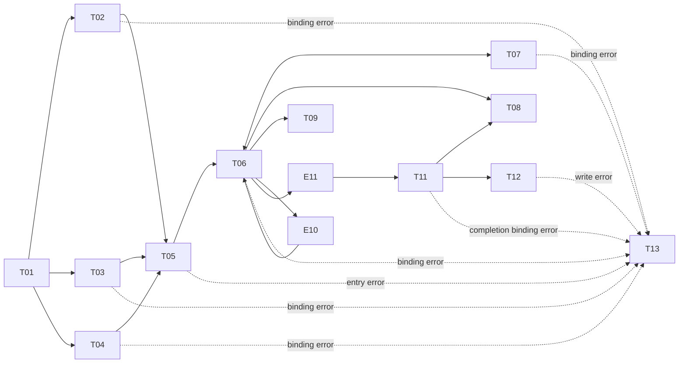
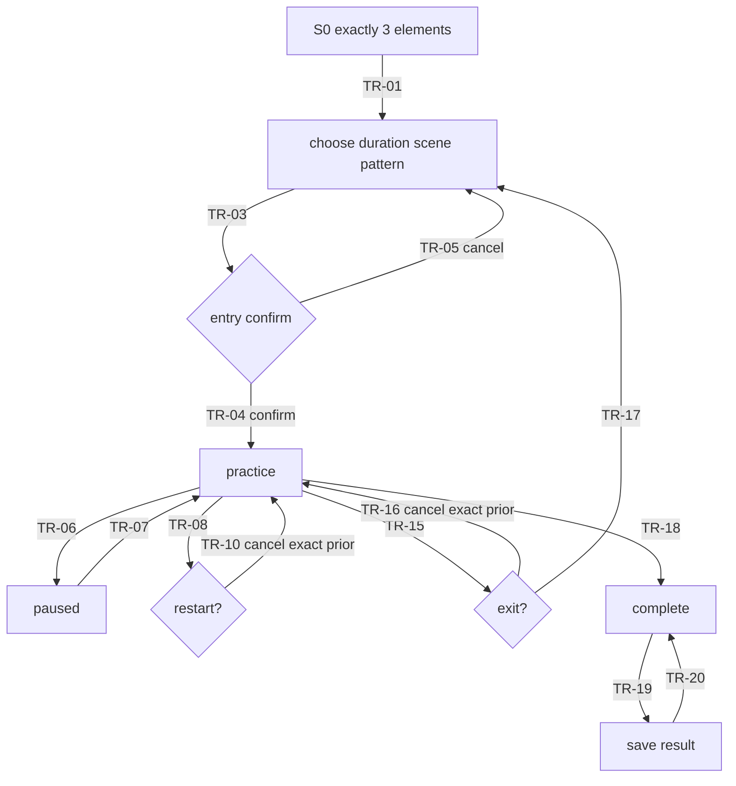

# Interaction / Spatial Design Spec · TideBeacon

> Active revision: 10 | Source revisions: interaction r9, visual r2 | Stage-12 repair CR-03

## 0. Stage Boundary

Early revisions enforced the no-future-facts boundary. Active r10 contains the sequentially derived Stage 9–11 container, state, layout, interaction, and motion facts.

## 1. Direct Description of Outputs

Stage 5 establishes design principles at the task boundary, the task/decision model, dependency graph, and benchmark coverage reconciliation.

## 2. Design Principles (task-boundary revision)

| # | Assertion-style principle | Scope | Derivation basis | Later checkpoint | Precedence |
|---|---|---|---|---|---|
| P1 | One authoritative active-time model must govern every rhythm-dependent output; pausing freezes that model. | product/data trust | PM R10/R14/R19/R20; UXR F4 | timeline, motion, bindings, tests | Highest when continuity conflicts with ornament or implementation convenience. |
| P2 | The user always decides duration, atmosphere, rhythm, entry, interruption, restart, and exit; cancellation commits no state change. | interaction/safety | PM R7–R18/R26; UXR risks | transitions and confirmation | Control/safety outranks shortest path. |
| P3 | Breathing guidance remains non-clinical and non-evaluative; no inferred body state is displayed or stored. | product/data | PM R4/R5; UXR S1 | copy, permissions, data contract | Safety wording outranks engagement. |
| P4 | Spatial value must be earned by distance, direction, depth, environmental audio, or time; additional windows or effects cannot manufacture it. | spatial | PM preliminary spatial necessity; UXR differentiation | Stage 6 spatial value | Task clarity and comfort outrank spectacle. |
| P5 | The core instruction and phase must be understandable with minimal reading and redundant non-color cues. | accessibility | PM R6/R22; PICO-COLOR-001 | visual and component semantics | Comprehension outranks decorative variety. |

- **Conflict arbitration**: P1 continuity and P2 control outrank P4 spatial expression; P3 safety outranks marketing or record detail; P5 comprehension outranks information density.
- **Negative list**: no detection/mic/score/health outcome; no camera travel or flashing; no independent channel clocks; no unconfirmed exit/restart commit; no fake local-save result; no particle accent before a complete cycle.
- **Concept consistency**: selected concept `Beacon Threshold` satisfies P1–P5; the Stage-7 review verified the comparison against compliant alternative B.

## 3. Task / Decision Model

| Task ID | Actor | Scenario | Input information / evidence | Decision output | Consequence of error | Frequency | Dependencies | Duration scale |
|---|---|---|---|---|---|---|---|---|
| T01 OrientToRhythm | user | first entry | exact instruction PM R6; lighthouse/halo intent; UXR U1/F1 | understands expand=inhale and return=exhale; decides to continue | reversed phase understanding or need for long tutorial | first run | none | comprehension target provisional; validate, no evidence-backed seconds |
| T02 ChooseDuration | user | setup | allowed values 2/4/6 from PM R7 | selected active duration | session unexpectedly long/short | every new/restarted session | T01 | quick choice; exact target provisional |
| T03 ChooseScene | user | setup | sea/cloud/dune from PM R8 | selected atmosphere | unwanted stimulation or illegible environment | every new session; restart may revisit | T01 | quick choice; exact target provisional |
| T04 ChooseRhythm | user | setup | ordered BreathPattern and available pattern definitions PM R9 | selected pattern ID and four phase durations | rhythm feels too fast/slow; invalid phase order | every session; explicit change | T01 | deliberate short choice; exact target provisional |
| T05 ConfirmPracticeEntry | user | ready to begin | selections T02–T04; Full Space cost is later-stage evidence | commit to start or cancel with prior selections intact | unexpected exclusive immersion or lost setup | once per start/restart | T02,T03,T04 | confirmation must not hide consequence |
| T06 FollowRhythm | user | active practice | phase, halo/audio/countdown derived from RhythmTimeline | follows current phase or chooses an interruption action | phase ambiguity, desynchronization, discomfort | continuous for 2/4/6 active minutes | T05 | frame-independent; duration excludes pauses |
| T07 PauseOrResume | user/system lifecycle | interruption | exact timeline snapshot, reason, audio gain | frozen or resumed at identical active-time position | skip/pop, duplicated cycle accent, countdown drift | zero or more per session | T06 | immediate freeze; resume fade target provisional |
| T08 RestartPractice | user | active/paused/completed | current state + prior selection | confirm restart or cancel unchanged | accidental loss of progress or wrong selections | occasional | T06, T07, or T11 | explicit confirmation |
| T09 ExitPractice | user/system back | active/paused | current state + stable return destination | confirm exit or cancel unchanged | accidental exit or trapped Full Space | occasional | T06 or T07 | explicit confirmation |
| E10 CompleteCycleAccent | system-derived domain event, not a user task | phase boundary | completed four-phase cycle count | emit one subtle accent or none | premature/repeated particles create false progress or flashing | once per complete cycle | T06/P1 | exact boundary, refresh-rate independent |
| E11 SessionBoundary | system-derived domain event | remaining active time reaches zero | authoritative remainingMs | stop active timeline and expose completion decision | incorrect duration or duplicate completion | once per completed session | T06 | exact duration boundary |
| T11 CompletionChoice | user | completion boundary reached | E11 + exact completion copy | save, restart, or exit | extra claims, ambiguous finish | once per completed session | E11 | immediate bounded choice |
| T12 SaveOptionalRecord | user | completion | minimal record fields; local persistence capability | save or skip; observe success/failure | fake success, privacy overreach, completion blocked | optional once per completion | T11 | Web validates semantics only; runtime write/readback separate |
| T13 RecoverFromBindingError | user/system | invalid/missing selection, timeline, audio, countdown, or write binding | binding-specific error/fallback state | retry, use safe default, remain paused, skip save, or exit | generic error hides affected fact | rare | any of T02–T07/T11–T12 | clear bounded recovery |

### Task dependency relationships

- T02/T03/T04 are parallel setup decisions and all gate T05.
- T07 is reversible and must preserve T06's active-time position.
- T08 is available from active, paused, or completed T11; T09 from active/paused. They are confirmed exits; cancel returns exactly to the snapshot.
- E10/E11 are deterministic domain events, not user-decision tasks.
- T12 is optional and cannot block completion/exit.

### Key decision list

| Decision ID | Output | Read-only / actionable | Must preserve on cancel? |
|---|---|---|---|
| D01 | instruction understood / continue | actionable | yes, first-entry scene unchanged |
| D02 | duration 2/4/6 | actionable | yes |
| D03 | scene sea/cloud/dune | actionable | yes |
| D04 | pattern ID / four phase durations | actionable | yes |
| D05 | enter practice | actionable, high-risk | yes |
| D06 | pause/resume | actionable | snapshot is authoritative |
| D07 | restart confirm/cancel | actionable, destructive | yes |
| D08 | exit confirm/cancel | actionable, high-risk | yes |
| D09 | optional save/skip | actionable | completion remains visible |
| D10 | save failure: retry or skip | actionable | yes |
| D11 | binding-specific recover: retry/safe default/remain paused/skip/exit | actionable | yes |

### Competitive functional coverage reconciliation

| Adjacent baseline / gap | TideBeacon disposition | Evidence |
|---|---|---|
| duration choice | covered by T02 with required 2/4/6 only | UXR C1/C3; PM R7 |
| pace / guidance customization | covered by T04, bounded to BreathPattern | UXR C1/C2/C3; PM R9 |
| explicit early end | covered by T09, confirmed | UXR C1; PM R13 |
| worldscape / spatial sound | represented as user choices and practice inputs, not yet interface facts | UXR C2; PM R3/R8/R10 |
| health metrics, AI personalization, large catalogs | deliberately omitted | PM R4/R5; UXR differentiation |
| local record | optional minimal event only, not a score/history dashboard | PM R17/R18 |

## 4. Spatial Value Justification

| Task | Spatial value judgment | Spatialization rationale | 2D counterfactual | Benchmark evidence | Rating |
|---|---|---|---|---|---|
| T01 | distance, direction, scale | A distant lighthouse and one halo make the phase metaphor legible as a spatial relationship without camera motion. | One centered circle and sentence could teach the mapping; 2D suffices for instruction alone. | UXR C1 is 2D/wearable; U3 requires TideBeacon spatial form. | Medium |
| T02 | none required | Duration is a bounded choice. | Planar segmented choice is sufficient. | C1/C3 configuration need. | Low |
| T03 | none required | Scene is a bounded atmosphere choice. | Planar preview/choice is sufficient. | direct user source. | Low |
| T04 | none required | Rhythm is a bounded pattern choice. | Planar named options/details are sufficient. | C1/C3 configuration need. | Low |
| T05 | no inherent spatial need; contextual Full Space consequence | Confirmation is a planar decision whose commit may enter the T06 spatial context. | A 2D confirmation fully handles the decision. | P1; UXR C2 spatial worldscapes. | Low for task itself |
| T06 | direction, distance, depth, spatial audio, time | The beacon stays distant and central; sea/wind audio occupies stable directions while halo scale and sound envelope share phase. | A 2D animation and stereo loop can pace breathing, but loses stable world-distance and environmental enclosure. | UXR differentiation; C2 vs C1/C3/C4. | High |
| T07 | no inherent spatial need; preserve context | Pause/resume is a timeline control rendered without relocating the beacon. | A 2D button/state fully handles it. | U4/P1. | Low |
| T08 | no inherent spatial need; preserve snapshot | Restart confirmation is a destructive planar decision. | A 2D dialog fully handles it. | PM R13/R26. | Low |
| T09 | no inherent spatial need; stable exit | Exit confirmation is a high-risk planar decision. | A 2D dialog fully handles it. | PICO-STAGE-001. | Low |
| E10 | optional time/peripheral depth | A complete-cycle accent can inhabit distant environment without score. | A quiet one-shot 2D glint, brief non-numeric tick, or no accent can acknowledge a cycle without a badge or game framing. | direct user requirement. | Medium expression, not Stage necessity |
| T11 | none required | Completion branching is a closure decision. | A concise planar completion surface is sufficient. | PM R17. | Low |
| T12 | none required | Optional save is a trust operation. | A planar action/result is sufficient. | PM R18. | Low |
| T13 | none required | Binding recovery needs precise copy/actions. | A planar binding-specific recovery surface is sufficient. | PM R27; UXR risks. | Low |

Conclusion: Stage necessity rests specifically on T06. T05/T07–T09 are 2D-capable decisions merely rendered in or adjacent to the preserved practice context; E10 is optional expression. Setup and completion must remain planar or minimally overlaid. No task justifies camera movement, body tracking, collaboration, or breathing sensing.

## 5. Design Hypotheses

| Hypothesis | Information model | Spatialization | Container concept (not final architecture) | User path | Primary interaction | Risk / cost |
|---|---|---|---|---|---|---|
| A · Beacon Threshold | Sparse planar orientation/setup, then explicit entry into a stationary surrounding coast where the lighthouse is the sole practice focus. | High only during practice; distance, halo depth, audio field, time. | One setup surface + one practice Stage candidate; exact containers deferred. | understand → choose three variables → confirm → practice → completion. | controller selections and pause; passive phase following. | Moderate; requires deterministic Stage transition and scene/audio synchronization. |
| B · Windowed Diorama | Entire experience stays in Shared Space as a bounded volumetric coastal diorama with attached controls. | Medium; depth inside a clipped volume, no exclusive space. | One volumetric window candidate; no Stage. | choices reshape diorama, then timer runs in place. | controller manipulates miniature scene. | Lower Stage risk but weaker distance/enclosure; possible toy-like interaction. |
| C · Shoreline Stations | Duration, scene, rhythm, and practice occupy separate spatial stations. | Very high and persistent. | Multiple spatial regions candidate. | turn among stations. | controller station selection. | Constraint-gated elimination: violates P4/P5 comfort and pseudo-spatiality constraints. |
| D · Audio-First Darkness | Minimal near-black environment; audio carries phase with tiny halo. | High audio / low visual scene depth. | Practice-first Stage candidate. | hear, choose, practice. | controller + audio. | Constraint-gated elimination: violates P5 redundant accessibility and R8 scene expression. |

## 6. Concept Selection Matrix

Constraint gate first: C and D remain for diversity but are eliminated before weighting. A and B are compliant counterproposals. Scores: 1=materially fails evidence/requirement, 2=major gaps, 3=adequate with risks, 4=strong evidence-aligned, 5=best comparative fit but never device-validated. Equal weights are used because PM r6 sets no priority weighting; safety or accessibility ≤2 would separately eliminate. Device comfort is `not_performed`, so no comfort score may claim validation.

| Hypothesis | Task efficiency | Spatial value | PICO comfort | Domain depth | Safety | Accessibility | Engineering feasibility | Uniqueness | Total | Verdict |
|---|---:|---:|---:|---:|---:|---:|---:|---:|---:|---|
| A | 5 PM setup path | 5 T06 depth/audio | 4 lower-risk hypothesis; device gap UXR S3 | 5 P1 timeline | 5 entry/exit/negative list | 4 dual cues | 4 procedural scene + deterministic clock | 5 single-timeline beacon | 37 | Selected among compliant A/B |
| B | 4 bounded path (T01–T05) | 3 clipped volume weakens T06 distance | 4 avoids Full Space but still device gap | 3 miniature metaphor weakens UXR lighthouse mental model | 4 legal Shared Space/lower exclusivity cost | 4 redundant cues/controller fit | 4 fewer Stage transitions, still volumetric work | 3 less aligned with user-required Stage | 29 | Compliant runner-up; rejected for weaker T06 distance/enclosure and explicit Stage brief. |
| C | n/a | n/a | n/a | n/a | n/a | n/a | n/a | n/a | n/a | Eliminated by P4/P5: head-turn/pseudo-spatial stations; not numerically scored. |
| D | n/a | n/a | n/a | n/a | n/a | n/a | n/a | n/a | n/a | Eliminated by P5 and R8: hearing dependence and scene undercoverage; not numerically scored. |

- **Selected concept**: `Beacon Threshold`—a sparse decision surface leads, by explicit confirmation, into a stationary lighthouse-centered coastal practice whose visual/audio/countdown outputs share one timeline.
- **Positioning**: versus C1/C3/C4, adds true world-distance/depth/directional audio to bounded pacing. Versus C2, the defensible opportunity is narrower: one auditable single-task timeline with explicit pause/lifecycle continuity; public interaction comparison remains a gap.
- **Differentiation rationale**: absorbs C1's phase legibility/exit, C2's worldscape/audio opportunity, and C3's bounded configuration. Any superiority, choice-cost, or distraction claim remains H-MKT-01–03 pending hands-on evidence. Evidence: UXR r3 §3A C1–C4.
- **Rejected options**: B weakens requested Stage value; C violates comfort/clarity; D depends too heavily on audio and underexpresses sea/cloud/dune.

## 7. Experience and Container Architecture

### 7.1 Experience layers

| Layer | Responsibility | Host | Entry / exit | Fallback |
|---|---|---|---|---|
| Orientation | teach the exact phase metaphor with exactly three visible product elements | `WC-SETUP` | app launch / acknowledge instruction | controller primary action always advances; no timed auto-advance |
| Setup | choose duration, scene, pattern | `WC-SETUP` | from orientation / confirm Stage entry | binding errors remain in setup with safe option-specific recovery |
| Practice | provide T06 distance/depth/directional-audio value with stationary camera | `STAGE-PRACTICE` + `WC-CONTROL` | confirmed T05 / completion or confirmed exit closes Stage | if Stage cannot open, return to setup with explicit error, never fake practice |
| Closure | exact completion and optional record | `WC-CONTROL` after Stage environment settles | E11 / restart or exit | save failure stays non-blocking |

### 7.2 Container selection

- **Space State**: orientation/setup run in Shared Space. Confirming `TR-04` opens `STAGE-PRACTICE`, switching to Full Space. Closing the Stage via `TR-17` returns to Shared Space.
- **`WC-SETUP`**: Planar WindowContainer, depth locked 640dp; carries the bounded 2D orientation/setup decisions. One primary window visible.
- **`STAGE-PRACTICE`**: Stage Full (immersion=100) with procedural low-poly sky/sea/cloud/dune variants, stationary user camera, distant lighthouse, halo, and spatial audio. No perception, microphone, hand-pose, plane, or spatial-anchor permission requested.
- **`WC-CONTROL`**: Planar WindowContainer shown inside Full Space only when practice controls or completion choices are invoked; normally minimized to a small near-lower control band. It never competes with the lighthouse focus.
- **Stage entry value**: T06 stable world-distance, depth, environmental surround, and directional sound.
- **Explicit entry**: `TR-03` opens `DIALOG-ENTRY`; only `TR-04` confirmation opens Stage. Cancel `TR-05` restores exact setup snapshot.
- **Stable exit**: system Back or Exit opens `DIALOG-EXIT`; confirm `TR-17` closes Stage and returns to `S1_SETUP`, cancel `TR-16` restores exact prior state (`S3_PRACTICE` or `S4_PAUSED`) and timeline snapshot.
- **Default visibility**: launch shows only `WC-SETUP`; Stage and control window hidden. In practice Stage is visible and `WC-CONTROL` is only visible on controller invocation/pause/confirmation/completion.

## 8. Window Attachment Decision Matrix

| Need | Placement mode | Selected type | Host | Semantic role | Persistence / frequency | Rationale | Rejected alternatives and rationale | Validation plan |
|---|---|---|---|---|---|---|---|---|
| duration/scene/pattern choices | in-window | InlineControl | WC-SETUP | current-step choices | setup-only / each session | choices act directly on setup content | None rejects required choices; TabBar wrongly makes steps pages; Toolbar wrongly treats choices as tools | controller traversal and focus order |
| Stage-entry decision | Docked temporary focus | Dialog | WC-SETUP | confirm Full Space switch | once/start | high-risk exclusive entry | InlineControl cannot block commit; None violates explicit entry | cancel snapshot equality + confirm target |
| pause/resume/exit/restart/rhythm | in-window | InlineControl | WC-CONTROL | current practice commands | invoked / medium | commands belong beside current run and do not justify docked toolbar | Toolbar would persist and compete with beacon; None removes required controls | controller access from every practice state |
| exit/restart decision | Docked temporary focus | Dialog | WC-CONTROL | destructive confirmation | occasional | blocks accidental state loss | InlineControl cannot guarantee confirmation; None violates PM R13/R26 | cancel exact prior state; confirm exact transition ID |
| local record | in-window | InlineControl | WC-CONTROL | optional completion action | once/completion | action belongs to completion | Dialog overstates risk; None omits requirement | real Web write/readback; runtime separate |
| spatial progress ornament | none | None | STAGE-PRACTICE | no attachment | n/a | complete-cycle accent is scene content, not UI attachment | Augment would attach to a window and misrepresent Stage environment; InlineControl irrelevant | no attachment exists |

Content exclusivity: no TabBar, Toolbar, Subwindow, Popup, Augment, Sheet, or Coachmark is selected. Dialog and InlineControl never duplicate the same action simultaneously.

## 9. Window Sizing Derivation

| Window | form/unit | tier/baseline | content/topology/density | viewing conditions | FOV check | floors/overhead | candidates | default; min/max | ratio/resize |
|---|---|---|---|---|---|---|---|---|
| WC-SETUP | Planar dp; depth 640dp | productivity; official start 1280×720; legal 320×180–2700×1800 | orientation then three bounded selections; single column/3-choice groups; medium density | seated/standing, ~1.75m, ≤30s provisional, Dynamic worldScale | default core under 55×32°; max under 65×40°; no peripheral critical content | targets ≥56dp; body ≥16sp (above 12); no TitleBar/attachments; inset 32dp | 960×720 Constrained fits one group + internal step flow; 1280×800 Compact fits all groups; 1440×900 Large adds scene previews | 1280×800; min 960×720, max 1440×900 | flexible 4:3–16:10; ContentMinSize; reflow not scaling |
| WC-CONTROL | Planar dp; depth 640dp | auxiliary/HUD | controls/completion; temporarily expands for dialog | ~1.5–1.75m, 2–6min, Dynamic | band <=45×12°; modal <=55×35° | target56; body16; dialog >=184 | 720×220 / 960×240 / 1120×280; modal 720×420 / 800×420 / 1120×480 | default960×240; min720×220; max1120×480 modal-only | ContentMinSize; wrap/expand, no scale |

- **Stage spatial bounds**: lighthouse nominally 12m visual distance straight ahead, halo angular diameter about 6°–14° across phases; these are project hypotheses for device validation, not physical comfort conclusions. Camera never moves.
- **Reflow**: Large shows scene thumbnails/pattern phase detail; Compact uses one-row groups; Constrained makes setup stepwise and wraps practice commands into two rows. Text/targets do not scale.
- **Shared-space occlusion**: only WC-SETUP is visible before Stage; no multi-window spacing requirement is triggered. The window stays within core FOV.
- **Downstream validation**: confirm logical dp sizes, angular occupation, target acquisition, text readability, and Stage lighthouse distance on target PICO hardware.

## 10. State Graph / Transition Graph

| State | Main task / decision | Primary focus | Container/layout/components (semantic, not Stage-11 anatomy) | Data dependency | Entry | Exit/continue | Exception recovery | Return strategy |
|---|---|---|---|---|---|---|---|---|
| S0_ORIENTATION | T01 understand/continue | lighthouse+halo+exact sentence | WC-SETUP sparse orientation | firstRun | launch | TR-01 | missing copy uses built-in exact string | system Back exits app |
| S1_SETUP | T02–T04 selections | current selection group | WC-SETUP setup | SessionSelection, Pattern | TR-01/TR-17 | TR-03 | binding-specific safe defaults | Back exits app after confirmation if selections dirty |
| S2_ENTRY_CONFIRM | T05 confirm/cancel | Full Space decision | DIALOG-ENTRY above WC-SETUP | exact setup snapshot | TR-03 | TR-04/TR-05 | Stage-open error returns S1 with snapshot | cancel exact S1 snapshot |
| S3_PRACTICE | T06 follow / choose action | distant beacon | STAGE-PRACTICE; WC-CONTROL hidden until invoked | RhythmTimeline + envelopes | TR-04/TR-07/TR-12/TR-16/TR-20 | TR-06/TR-08/TR-13/TR-15/E11 | audio/visual fallback binds remain timeline-derived | Back triggers TR-15 only |
| S4_PAUSED | T07 resume/exit/restart | paused beacon + frozen phase | Stage + visible WC-CONTROL | PauseSnapshot | TR-06 or lifecycle suspend | TR-07/TR-08/TR-13/TR-15 | error stays paused | Back triggers TR-15; no auto-resume |
| S5_RESTART_CONFIRM | T08 confirm/cancel | restart decision | DIALOG-RESTART | exact prior state + snapshot | TR-08 | TR-09/TR-10 | failure restores prior | cancel exact prior S3/S4/S7 |
| S6_EXIT_CONFIRM | T09 confirm/cancel | exit decision | DIALOG-EXIT | exact prior state + snapshot | TR-15 | TR-16/TR-17 | failure restores prior | cancel exact prior S3/S4 |
| S7_COMPLETE | T11/T12 finish/save/restart/exit | exact completion copy | WC-CONTROL completion | E11, LocalPracticeRecord | TR-18 | TR-08/TR-19/TR-21 | save failure binding-specific, non-blocking | restart confirm or exit Shared Space |
| S8_SAVE_RESULT | observe real save outcome | success/failure label | WC-CONTROL completion | local write/readback result | TR-19 | TR-20/TR-21 | failure offers retry/skip | returns S7 without losing completion |
| S9_STAGE_ERROR | recover Stage entry | error + return | WC-SETUP | entry error | TR-22 | TR-23 | retry reopens confirmation | return exact S1 snapshot |

| Transition ID | Start | Target | Trigger event | Exact action | Confirmation |
|---|---|---|---|---|---|
| TR-01 | S0 | S1 | `user.ackInstruction` | `showSetupPreservingFirstRunFact` | no |
| TR-03 | S1 | S2 | `user.requestPractice` | `snapshotSetupAndOpenEntryDialog` | yes begins |
| TR-04 | S2 | S3 | `user.confirmEntry` | `openStageAndStartTimeline` | yes confirms |
| TR-05 | S2 | S1 | `user.cancelEntry` | `restoreExactPriorSnapshot` | no |
| TR-06 | S3 | S4 | `user.pause` or `app.suspend` | `freezeTimelineAndAudioAtSnapshot` | no |
| TR-07 | S4 | S3 | `user.resume` or `app.resumeConfirmed` | `resumeSameTimelineAndFadeGain` | no |
| TR-08 | S3/S4/S7 | S5 | `user.requestRestart` | `captureExactPriorAndOpenRestartDialog` | yes begins |
| TR-09 | S5 | S1 | `user.confirmRestart` | `closeStageResetTimelineKeepOrEditSelection` | yes confirms |
| TR-10 | S5 | `$priorState` | `user.cancelRestart` | `restoreExactPriorStateAndTimeline` | no |
| TR-12 | S3 | S3 | `user.selectRhythmDuringPractice` | `queuePatternForRestartWithoutMutatingActiveRun` | no |
| TR-13 | S3/S4 | S5 | `user.applyQueuedPattern` | `requestRestartForNewPattern` | yes begins |
| TR-15 | S3/S4 | S6 | `user.requestExit` or `system.back` | `captureExactPriorAndOpenExitDialog` | yes begins |
| TR-16 | S6 | `$priorState` | `user.cancelExit` | `restoreExactPriorStateAndTimeline` | no |
| TR-17 | S6 | S1 | `user.confirmExit` | `closeStageReturnSharedSpace` | yes confirms |
| TR-18 | S3 | S7 | `timeline.sessionComplete` | `freezeAtEndShowExactCompletion` | no |
| TR-19 | S7 | S8 | `user.saveRecord` | `performLocalWriteReadback` | no |
| TR-20 | S8 | S7 | `user.dismissSaveResult` | `preserveCompletionReturn` | no |
| TR-21 | S7/S8 | S1 | `user.finishWithoutSave` | `closeStageReturnSetup` | no |
| TR-22 | S2 | S9 | `system.stageOpenFailed` | `showEntrySpecificError` | no |
| TR-23 | S9 | S1 | `user.returnToSetup` | `restoreExactSetupSnapshot` | no |

Transition implementation contract: buttons dispatch these exact string IDs, never array positions. Dialogs store `priorState`, `priorSelection`, `priorTimelineSnapshot`, and `priorControlVisibility`; cancel restores all four byte-for-byte except ephemeral focus highlight.

## 11. End-to-End User Flow

- **Happy path**: S0 → S1 → S2 confirm → S3 for 2 minutes → S7 → optional S8 → S1/exit.
- **Interruption**: lifecycle suspend always enters S4; returning foreground does not advance until resume handling.
- **Entry error**: S2 → S9 → exact S1 snapshot.

## 12. Eye-Hand / Controller Interaction

- All actions support gaze-focus + pinch and controller ray + trigger; controller D-pad/stick traverses deterministic focus order. Menus are completable with controllers alone.
- System Back in S3/S4 dispatches exact `TR-15`; in dialogs it dispatches the declared cancel transition ID; in S0 exits app.
- Buttons dispatch their literal `TR-*` string from binding, never an array index.
- C2 option activation selects one value; start dispatches TR-03. C3 maps pause/resume TR-06/TR-07, rhythm TR-12, restart TR-08, exit TR-15. C4 uses exact bound cancel/confirm IDs. C5 maps TR-19/TR-08/TR-21.
- Dialog open captures `{priorState, priorSelection, priorTimelineSnapshot, priorControlVisibility}`. Cancel restores equality of all four; focus highlight is the only permitted difference.
- Error recovery is binding-specific through C6. Timeline errors force pause; save failure never blocks exit; Stage-open failure returns S1 snapshot.

## 13. Motion and Timeline Spec

| Scenario | Type | Duration | Easing/amplitude | Reduce Motion | Performance fallback |
|---|---|---:|---|---|---|
| Stage entry | fade environment | 600ms | ease-out; no camera translation | 300ms fade | flat matte sky/sea layers |
| Stage exit | fade | 400ms | ease-in-out | 200ms fade | immediate safe close after fade |
| halo inhale/exhale | scale+opacity from timeline | BreathPattern phase duration | 6°-14°; no flash | boundary-step sizes + labels | 12Hz sampled interpolation, same timeline |
| hold | fixed halo + dashed cue | hold duration | no displacement | identical | static |
| controls/dialog | fade + <=12dp slide | 180ms | ease-out | fade only 100ms | instant visibility with state label |
| focus | outline + <=1.03 | 120ms | ease-out | outline only | outline only |
| resume audio | gain ramp | provisional 350ms | continuous 0→prior gain | identical gain ramp | linear gain ramp |
| cycle accent | one subtle star/particle | 600ms max | peripheral <=2°, emitted after full cycle | one static star appears | omit particle, keep static star |

- No virtual camera movement, full-field flash, infinite pulse, or partial-cycle accent.
- `RhythmTimeline` uses monotonic active time: `activeElapsed = now - origin - accumulatedPaused`. Each channel derives phase/progress/remaining from this value every update.
- Explicit and lifecycle pause capture the same snapshot and stop audio scheduling. Resume keeps the exact active elapsed value, reanchors origin, and ramps volume.
- Test matrix: simulate 60/72/90/120Hz with identical phase boundaries and completion; pause at every phase and frame-edge; lifecycle suspend/resume; multiple pauses; cancel every confirmation from every allowed prior state; ensure no duplicate E10; exact 2-minute run excluding pause.
- Accessibility: `reduceMotion=true`, `controllerFallback=true`, `colorIndependentSemantics=true`, `textScaling=true`, `stableExit=true`.

## 14. Layout Skeleton and Placement Geometry

| Layout ID | States | Derivation evidence | Single focus | Regions / ownership | Density ceiling | Responsive transformation | Rejected option |
|---|---|---|---|---|---|---|---|
| L0 HorizonOrientation | S0 | T01; exact 3 elements; V1; no action chrome | lighthouse+halo | far subject; halo; one sentence below | exactly 3 visible product elements | same semantics all tiers; sentence wraps max 2 lines; lighthouse remains far | visible continue button rejected because it would be fourth element |
| L1 BoundedSetup | S1/S9 | parallel T02–T04; medium frequency; WC size | current choice group | header/status; duration; scene; pattern; start | max 3 choice groups, one primary button | Large thumbnails+phase detail; Compact three rows; Constrained one group per step | cards/dashboard rejected; multiple windows rejected |
| L2 BeaconPractice | S3 | T06 single focus; Stage value; stationary FOV | lighthouse halo | far environment; lighthouse+halo; hidden near control band; countdown/phase near-lower only when invoked | 1 hero + max 2 text facts + 5 commands when open | Stage unchanged; WC control wraps 1→2 rows | persistent HUD rejected; camera-following particles rejected |
| L3 FrozenPractice | S4 | P1 freeze; interruption control | frozen halo/phase | same Stage; visible control band with paused label | 1 hero + pause fact + commands | band wraps; no scene scaling | full-screen opaque pause panel rejected |
| L4 ExactPriorDialog | S2/S5/S6 | high-risk confirmation + PM R26 | dialog decision | preserved background; dialog title/body; confirm/cancel | 2 actions | 2 columns → stacked at Constrained | separate confirmation page rejected because it loses prior context |
| L5 QuietCompletion | S7/S8 | exact copy + optional local action | completion sentence | completion copy; optional save; result; restart/exit | 1 copy + 3 actions + 1 result | single row → vertical actions | metrics/history dashboard rejected |

| layer | anchor | x/y | w/h | z |
|---|---|---|---|---:|
| Stage environment | user floor center | 0/0 | boundless | 0 |
| lighthouse | forward horizon | 0/+0.15m | angular 2°×8° | 8m visual depth cue / nominal 12m hypothesis |
| halo | lighthouse center | 0/0 | angular 6°–14° | lighthouse plane +0.02m |
| WC-SETUP | view center | 0/0 | 1280×800dp | near 20 |
| WC-CONTROL | lower-center | 0/-0.28m visual angle | 960×240dp | near 24 |
| Dialog | host center | 0/0 | 640×360dp logical | foreground 40 |

- Region gaps use 16/24/32dp tiers later frozen in visual tokens.
- Every layout preserves `primaryFocusCount=1`.
- L0, L1, L4, and L5 remain 2D compositions; only L2/L3 use the Stage environment.

## 15. Minimum Completeness Gate

| Check Item | Minimum Pass Condition | Evidence Anchor | Verdict |
|---|---|---|---|
| Principles and tasks | principles have basis/landing/precedence; every task has inputs, output, error, frequency, dependencies | §2–§3 | pass |
| Spatial value and concept | each task has counterfactual; 4 hypotheses; matrix and rejections complete | §4–§6 | pass |
| Container and attachment | legal space state, Stage value/exit, None/InlineControl comparison | §7–§8 | pass |
| Window sizing | baseline/view/FOV/floors/candidates/default-min-max/reflow | §9 | pass |
| States and flow | states have focus/data/exception/return; exact-ID transitions; stable exit | §10–§11 | pass |
| Implementation spec | interaction, back, exact IDs, recovery, motion, Reduce Motion, layout geometry implementable | §12-§14 | pass |

| Field | Value |
|---|---|
| minimumCompletenessGate | pass |

## 16. Delivery and Recipients

Stage-5 task/decision model to interaction/XR designer and later design-system roles.
